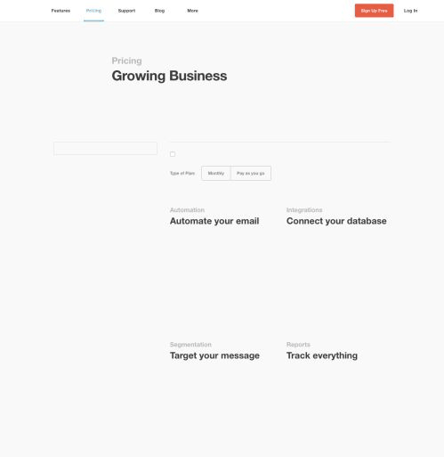

> alpha software is alpha

Turn a chrome timeline.json into a gif

[](https://crates.io/crates/timeline)  [](https://travis-ci.org/stevenosloan/timeline)

Here's an example taken from the MailChimp pricing page limitting the network to 4G.

```bash
$ timeline TimelineRawData-20160504T111355.json
# => Generating timeline gif for: TimelineRawData-20160504T111355.json
# => Will output to: TimelineRawData-20160504T111355.gif
```

[](resources/TimelineRawData-20160504T111355.gif)


Installation
------------

You can either build it yourself with rust, or download the compiled binary for the [desired release](https://github.com/stevenosloan/timeline/releases) on your platform. To install the most current for OSX:

```bash
$ curl -OL https://github.com/stevenosloan/timeline/releases/download/0.1.0/timeline-0.1.0-x86_64-apple-darwin.tar.gz
$ tar xzf timeline-0.1.0-x86_64-apple-darwin.tar.gz
$ cp timeline /usr/local/bin/
```

You could place it elsewhere, just make sure that it ends up on your `$PATH`.


Usage
-----

```bash
$ timeline

  timeline 0.1.0
  Steven Sloan <stevenosloan@gmail.com
  Generate a gif from Chrome timeline data

  USAGE:
      timeline [FLAGS] [OPTIONS] <input>

  FLAGS:
      -h, --help       Prints help information
      -V, --version    Prints version information

  OPTIONS:
      -o, --output <output>    output file (default is INPUT.gif)

  ARGS:
      <input>    timeline file
```


Testing
-------

> TODO: Add tests


Contributing
------------

If there is any thing you'd like to contribute or fix, please:

- Fork the repo
- Add tests for any new functionality
- Make your changes
- Verify all new & existing tests pass
- Make a pull request


License
-------

`timeline` is distributed under the [MIT License](LICENSE).
